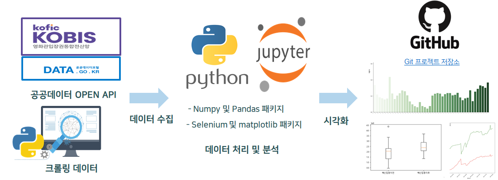
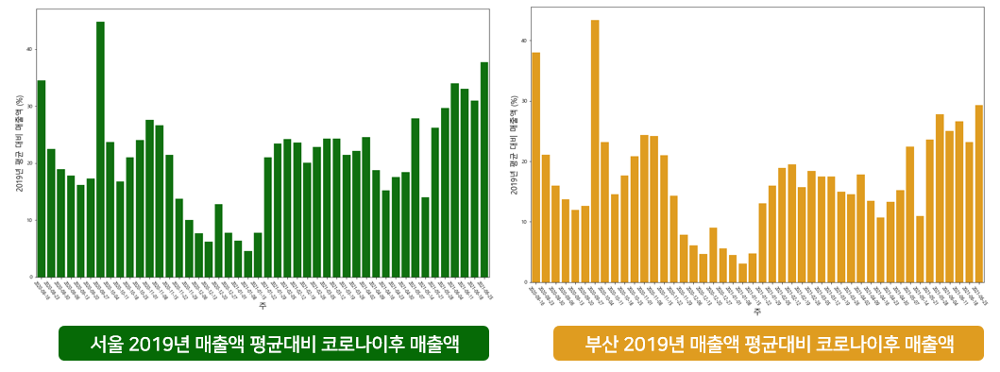
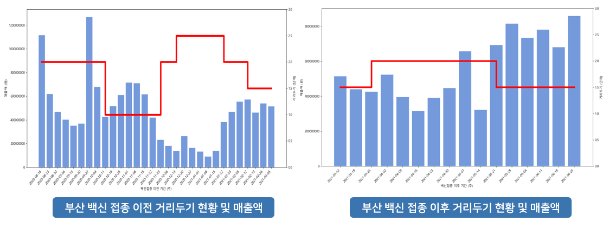
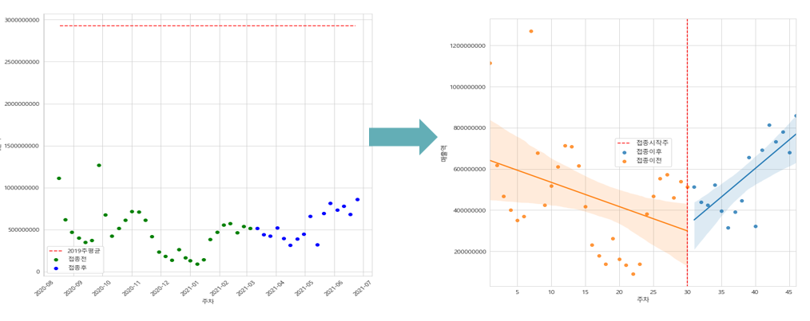
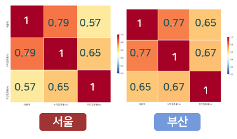

## 코로나 백신과 영화 산업 상관관계 분석 및 시각화

2021년 3월 이후 본격적인 코로나 백신 접종이 시작됨에 따라 코로나 백신이 영화 산업에 미치는 영향 분석

------

### 개요

지역에 따라 백신접종이 영화 산업에 미치는 영향을 파악하기 위해 제1도시(서울)와 제2도시(부산)의 데이터 분석 및 비교

### 프로젝트 기간

2021.08.02 ~ 20201.08.24

### 수행역할

데이터 수집부터 저장과 처리 그리고 데이터분석까지 AWS를 사용하여 데이터파이프라인 개발

- Python을 이용하여 Spotify API를 통해 아티스트의 데이터수집
- 데이터 전처리 후 AWS RDS 및 AWS DynamoDB에 데이터저장
- raw 데이터와 Spotify의 음악메타데이터를 AWS S3에 저장하여 DataLake 구현
- AWS Athena를 통해 유사도를 계산하고, Mysql에 저장하여 DataMart로 활용
- 입력한 아티스트의 정보 뿐만 아니라 유사한 음악을 추천할 수 있는 Serverless 카카오톡 챗봇 서비스 개발

### 아키텍쳐

### 프로젝트 결과물

주요 결과물 (자세한 내용은 포트폴리오 참고)

### 결론 및 향후 과제

결론

- 코로나 백신과 영화 매출액에는 상관관계 확인
  - 누적접종률이 주간접종률보다 강한 상관관계를 갖고 있음
  - 코로나 백신과 영화매출액의 상관관계는 지역별 차이가  존재
- 영화산업에서 코로나 백신의 경제적효과가 있을 것으로 전망
- 

한계점 및 해결방안

- 거리두기를 고려하다보니 계절성을 고려하고, 적절한 크기의 표본을 선정하는데 어려움이 존재
       → 접종 이후의 데이터 확보 필요
- 지역별 차이에 대한 표본이 부산 한 곳이므로 , 이를 명확하게 확인할 수 없음 
       → 타 지역 데이터분석 필요
- 코로나 백신과 영화매출액의 상관관계는 지역별 차이가 존재
       → 설문자료 및 여론조사 관련 추가 데이터수집 필요
